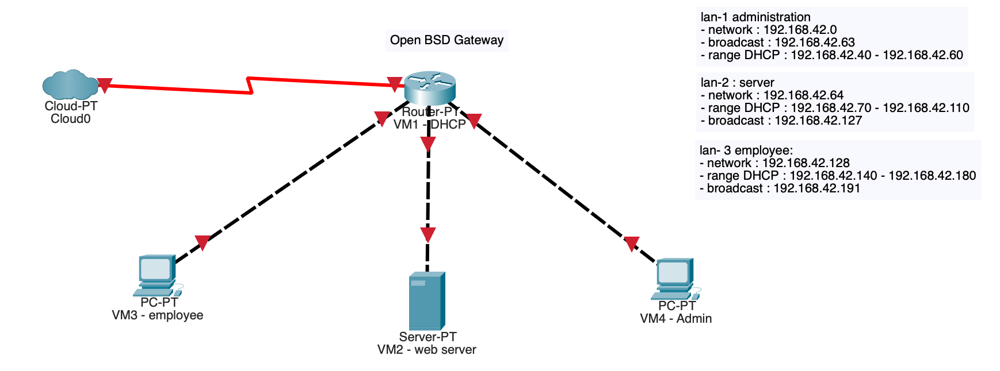

## 3eme Projet Piscine Epitech 
### T-NSA-501
Nicolas et Gino

Date de début : Lundi 2 décembre 2024  
Date de fin : Dimanche 15 décembre 2024 à 23h42  

### Objectif du projet : 
Réaliser un réseau d'entreprise avec : 
  - un routeur,
  - un serveur,
  - un client employé,
  - un client administrateur,

## Detail du projet
### Routeur DHCP : 
  - OpenBSD
  - 4 réseaux :
    - Nat,
    - em1 (Administrateur): Réseau privé / range DHCP : 192.168.42.40 - 192.168.42.60,
    - em2 (Serveur): Réseau privé / range DHCP : 192.168.42.70 - 192.168.42.110,
    - em3 (Employé): Réseau privé / range DHCP : 192.168.42.140 - 192.168.42.180,

### Serveur : 
  - FreeBsd, 
  - Connecté à la em2,
  - configuration : 
      - PHP version 7.4
      - MySQL

 ### Employé : 
   - Debian avec interface graphique via Gnome,
   - Connecté à la em3,
   - Règle :
     - Accès à internet via le réseau nat du routeur,
     - Peut communiquer avec le client Administrateur,
     - Peut communiquer avec le serveur uniquement via le réseau HTTP / HTTPS,

### Administrateur : 
   - Debian avec interface graphique via Gnome,
   - Connecté à la em1,
   - Règle :
     - Accès à internet via le réseau nat du routeur,
     - Peut communiquer avec le client Administrateur et le serveur,
       

Schéma du réseau :

